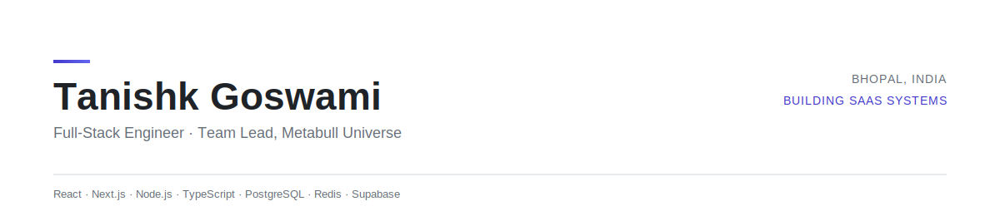

<picture>
  <source media="(prefers-color-scheme: dark)" srcset="assets/banner-dark.svg">
  
</picture>

  

 

## About

I lead a development team at **Metabull Universe**, where I design and ship the SaaS products across our ecosystem — from real-time WhatsApp automation to billing infrastructure. My work sits at the intersection of product architecture and hands-on implementation: I write the backend, own the data model, and make the call on what ships.

Outside of Metabull, I build and run **Truwok**, a freelancer marketplace, solo — end to end, from schema to deploy.

**Stack:** React, Next.js, Node.js, TypeScript, PostgreSQL, Redis, Supabase
**Integrations:** Meta WhatsApp Cloud API, OAuth 2.0, Razorpay, Google APIs

 

## Building

<table>
<tr>
<td width="50%" valign="top">

**GAP AI Agent**
WhatsApp business automation platform — core Metabull product. Flow-based and fallback AI agent logic, session state routing, and entry-source detection via WhatsApp's referral object.

</td>
<td width="50%" valign="top">

**QuickPost**
Social media scheduling and Instagram Auto-DM, with a three-tier billing system (Free / Pro / Enterprise) built on Razorpay.

</td>
</tr>
<tr>
<td width="50%" valign="top">

**SuperMailBox**
CPaaS layer for the Metabull ecosystem — transactional email, broadcast campaigns, and notification delivery across products.

</td>
<td width="50%" valign="top">

**Truwok**
Solo-built freelancer marketplace — [truwok.com](https://truwok.com)

</td>
</tr>
</table>

 

## Stack

<table>
<tr>
<td valign="top" width="25%"><strong>Frontend</strong></td>
<td valign="top">

</td>
</tr>
<tr>
<td valign="top"><strong>Backend</strong></td>
<td valign="top">

</td>
</tr>
<tr>
<td valign="top"><strong>Data &amp; Infra</strong></td>
<td valign="top">

</td>
</tr>
<tr>
<td valign="top"><strong>Tools</strong></td>
<td valign="top">

</td>
</tr>
</table>

 

## Activity

<picture>
  <source media="(prefers-color-scheme: dark)" srcset="https://github-readme-stats.vercel.app/api?username=YOUR-GITHUB-USERNAME&show_icons=true&theme=github_dark&hide_border=true&bg_color=0D1117&title_color=E6EDF3&icon_color=4F46E5&text_color=8B949E">
  
</picture>

 

## Connect

Open to freelance collaborations, architecture discussions, and full-stack roles.

[**Portfolio**](https://tanishkgoswami-portfolio.vercel.app/) &nbsp;·&nbsp; [**LinkedIn**](https://www.linkedin.com/in/designwithtanishk/) &nbsp;·&nbsp; [**Email**](mailto:designwithtanishk@gmail.com)